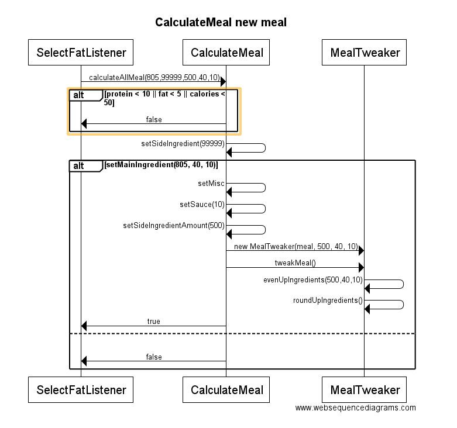
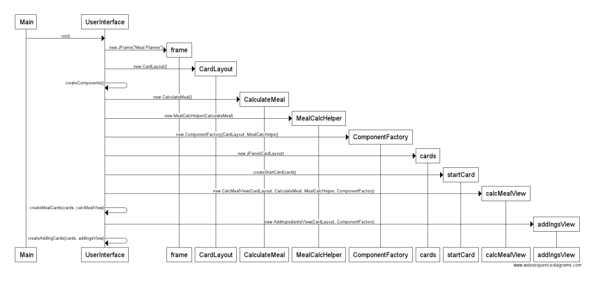
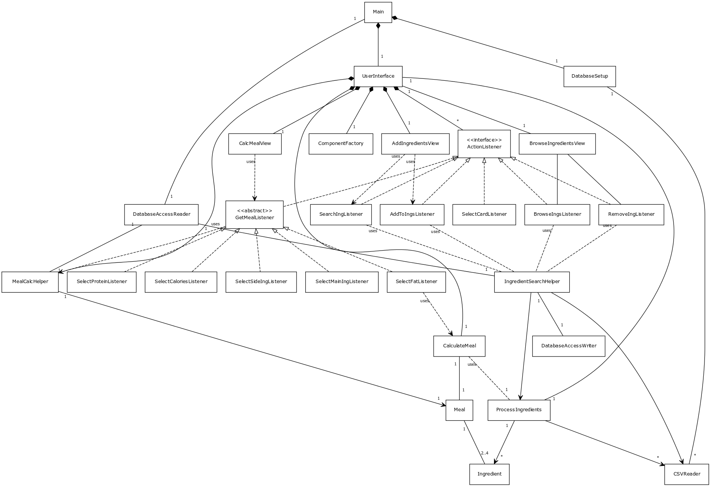

##MealPlanner##
####Pieni työkalu ravitsemuksen suunnitteluun####

**Aihe:** Ohjelman tarkoituksena on tarjota työkalu, jolla käyttäjä voi kalorimäärän sekä makrojen perusteella saada selville mitä pitäisi syödä ja paljonko, esimerkiksi lounaalla. Käyttäjä syöttää haluamansa pääraaka-aineen ja lisäkkeen, kalorimäärän sekä proteiinin ja rasvan määrän ja saa vastauksena grammamääräisenä tarvittavat ruoka-aineet joista lounaan tulee koostua sekä lopulliset ravintoarvot (joissa saattaa olla pientä heittoa toivotuista pyöristysten takia). Ohjelma käyttää avointa dataa jonka tarjoaa Terveyden ja hyvinvoinnin laitos, Fineli (Creative Commons 4.0 nimeä (CC-BY 4.0)). Dataan on lisätty ravintotiedot Nyhtökauran osalta, koska sitä ei (vielä) Finelin tietokannasta löydy. Uusi päivitys on luvattu vuodenvaihteessa, jos se toteutuu tullaan ohjelmassa luonnollisesti käyttämään uusinta dataa. Nyhtökauran osalta ravintotiedot ovat siis Gold and Green -yhtiön antamia, eivätkä THL:n laskemia.

**Käyttäjät:** tavoitteellisten kuntoilijoiden, laihduttajien ja vaikkapa personal trainereiden käyttöön

**Käyttäjien toiminnot:** Käyttäjä valitsee haluamansa pääraaka-aineen, lisäkkeen (myös satunnainen valittavissa) sekä haluamansa kalorimäärän, proteiinin määrän ja rasvan määrän. Ainakin alkuvaiheessa ohjelma valitsee lisukkeen (tässä vaiheessa automaattisesti uunijuurekset, käyttäjä voi lisätä uusia satunnaisiin) ja kastikkeen, mutta tulevaisuudessa käyttäjä voi vaikuttaa siihen myös itse. Lopuksi  ohjelma kertoo paljonko mitäkin raaka-ainetta pitää olla ja paljonko kaloreita lopullisessa annoksessa on. Ohjelma kertoo myös makrot ja mahdolliseti tarkempia ravintotietoja, data mahdollistaa myös allergeenien sekä vitamiinimäärien näyttämisen, myös rasvojen erottelu eri koostumuksiin on mahdollista.

##Pari sekvenssikaaviota##

###Toteutusvaiheen eräs luokkakaavio###

##Rakennekuvaus##

Ohjelman mainin käynnityessa tarkistetaan onko tietokantaa olemassa ja jos ei ole, se luodaan, lisätään tarvittavat taulut sinne ja täytetään ne CSV-tiedostoista saatavilla tiedoilla. Tämän jälkeen tarkistetaan vielä tietokannan toimivuus ja käynnistetään graafinen käyttöliittymä. Käyttöliittymä käyttää CardLayoutia ja koostuu kuudesta osasta. UserInterface on pääluokka josta muut luokat luodaan, CalcMealView:sta käsittää kaikki aterian laskemiseen liittyvät kortit, AddIngredients:sta joka sisältää raaka-aineen lisäämiseen tietokantaan liittyvät komponentit, BrowseIngredientView:sta joka sisältää raaka-aineiden selailuun ja poistamiseen liittyvät komponentit, ComponentFactorysta jossa voidaan luoda useasti käytettyjä (seassa muutama toistaiseksi vain kerran käytettykin) komponentteja sekä joukosta ActionListenereita, jotka ovat omissa luokissaan gui.controllers paketin alla. Käyttöliittymän kanssa tiiviissä yhteistyössä toimivat apuluokat MealCalcHelper ja IngredientSearchHelper. MealCalcHelper tarjoaa pääsyn raaka-aineisiin metodiensa kanssa, sekä kerää ActionListenereilta käyttäjän antamat arvot talteen, kunnes ne luovutetaan CalculateMealille. IngredientSearchHelper auttaa raaka-aineiden haun kanssa AddIngredientsView'ta sekä BrowseIngredientsView'ta raaka-aineiden lisäämiseen ja poistamiseen tietokannasta. Ateriaa laskiessa ainoastaan MainIngredient-kortti on alussa valmiina, muut kortit luodaan sitä mukaan kun käyttäjä antaa arvoja. UI myös luo ProcessIngredients-olion, joka annetaan kaikille eteenpäin, jottein tietokantaa tarvitse käsitellä useammin kuin pakollista.

Varsinaisen ohjelman ytimen muodostavat CalculateMeal ja sen apuluokat MealTweaker sekä ProcessIngredients. CalculateMeal laskee aterian saatuaan käyttöliittymältä käyttäjältä kerätyt toiveet. Kun ateria (Meal) on saatu kasattua, annetaan se MealTweakerille joka pyörittelee sitä aikansa ja yrittää päästä mahdollisimman lähelle haluttua lopputulosta. Kaikissa tapauksissa täysin haluttuja makroja ei voi saada aikaiseksi, mutta ainakin kalorit saadaan kohdalleen, muissa voi olla heittoja. ProcessIngredients kerää tietokannasta (DatabaseAccessReader) tai tiedostoista (CSVReader) raaka-aineet (Ingredient) ja niiden makrot ja tarjoaa ne CalculateMealille käyttöön.

Käyttäjä voi lisätä raaka-aineita käyttöönsä, jolloin DatabaseAccessWriter kirjoittaa tiedot tietokannan tauluun saatuaan ohjeet IngredientSearchHelperiltä.

