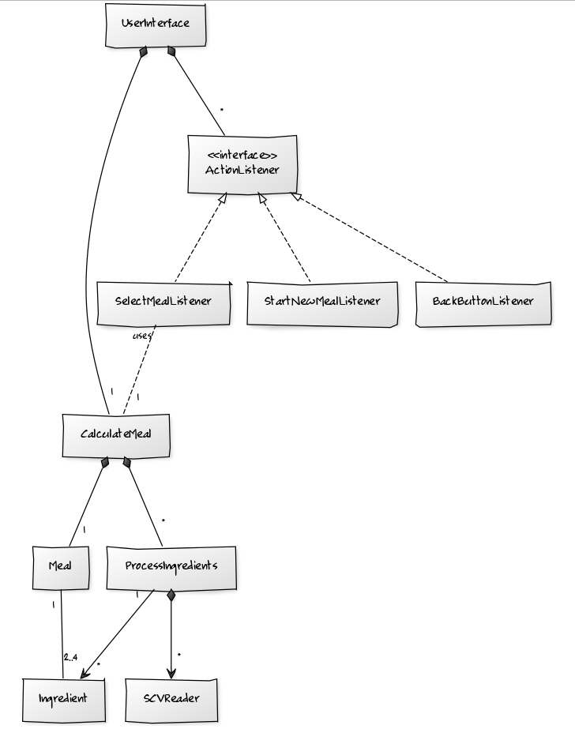

##MealPlanner##
####Pieni työkalu ravitsemuksen suunnitteluun####

**Aihe:** Ohjelman tarkoituksena on tarjota työkalu, jolla käyttäjä voi kalorimäärän sekä makrojen perusteella saada selville mitä pitäisi syödä ja paljonko, esimerkiksi lounaalla. Käyttäjä syöttää haluamansa kalorimäärän sekä proteiinin ja rasvan määrän ja saa vastauksena grammamääräisenä tarvittavat ruoka-aineet joista lounaan tulee koostua sekä lopulliset ravintoarvot (joissa saattaa olla pientä heittoa toivotuista pyöristysten takia). Ohjelma käyttää avointa dataa jonka tarjoaa Terveyden ja hyvinvoinnin laitos, Fineli (Creative Commons 4.0 nimeä (CC-BY 4.0)). Dataan on lisätty ravintotiedot Nyhtökauran osalta, koska sitä ei (vielä) Finelin tietokannasta löydy. Uusi päivitys on luvattu vuodenvaihteessa, jos se toteutuu tullaan ohjelmassa luonnollisesti käyttämään uusinta dataa. Nyhtökauran osalta ravintotiedot ovat siis Gold and Green -yhtiön antamia, eivätkä THL:n laskemia.

**Käyttäjät:** tavoitteellisten kuntoilijoiden, laihduttajien ja vaikkapa personal trainereiden käyttöön

**Käyttäjien toiminnot:** Käyttäjä valitsee haluamansa pääraaka-aineen sekä haluamansa kalorimäärän, proteiinin määrän ja rasvan määrän. Ainakin alkuvaiheessa ohjelma valitsee lisukkeet ja kastikkeen, mutta tulevaisuudessa käyttäjä voi vaikuttaa siihen myös itse. Lopuksi  ohjelma kertoo paljonko mitäkin raaka-ainetta pitää olla ja paljonko kaloreita lopullisessa annoksessa on. Ohjelma kertoo myös makrot ja mahdolliseti tarkempia ravintotietoja, data mahdollistaa myös allergeenien sekä vitamiinimäärien näyttämisen, myös rasvojen erottelu eri aminohappokoostumuksiin on mahdollista.

###Toteutusvaiheen eräs luokkakaavio###

