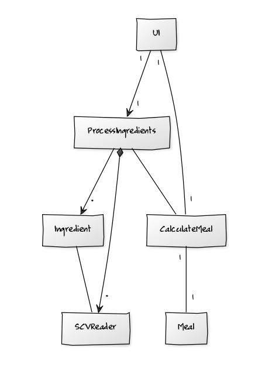

##MealPlanner##
####Pieni työkalu ravitsemuksen suunnitteluun####

**Aihe:** Aterioiden suunnittelija, jossa kalorit ja makrot määrittelemällä ohjelma ehdottaa sinulle sopivaa annosta tarkoilla grammamäärillä. Valittavissa muutamia pääraaka-aineita, lisukkeita ja kastikkeita. Kaikki ravintoarvot saadaan avoimesta datasta, jonka tarjoaa [Terveyden ja hyvinvoinnin laitos, Fineli](https://fineli.fi/fineli/fi/index) ([Creative Commons 4.0 nimeä (CC-BY 4.0)](https://creativecommons.org/licenses/by/4.0/deed.fi))
 Data tulee ohjelman mukana scv-tiedostoina. Ohjelmaan tulee myös todennäköisesti mahdollisuus selata ja hakea koko tietokantaa, noin 4000+ tuotetta.

**Käyttäjät:** tavoitteellisten kuntoilijoiden, laihduttajien ja vaikkapa personal trainereiden käyttöön

**Käyttäjien toiminnot:** Käyttäjä valitsee haluamansa kalorimäärän annokselle, haluamansa proteiinin sekä rasvan määrän. Loppu on hiilihydraatteja. Seuraavaksi käyttäjä valitsee pääraaka-aineen listalta. Mahdollisesti ohjelma ehdottaa sopivaa lisuketta, mutta käyttäjä voi vaikuttaa siihen myös itse. Lisäksi valitaan kastike ja mahdollset muut lisukkeet, jotka saattavat kyllä tulla automaattisesti ohjelman puolesta. Lopuksi  ohjelma kertoo paljonko mitäkin raaka-ainetta pitää olla ja paljonko kaloreita lopullisessa annoksessa on. Ohjelma kertoo myös makrot ja mahdolliseti tarkempia ravintotietoja.

###Määrittelyvaiheen luokkakaavio###

